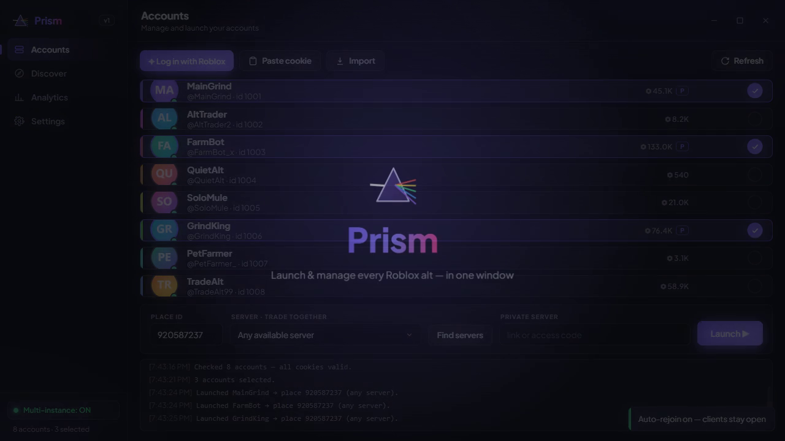
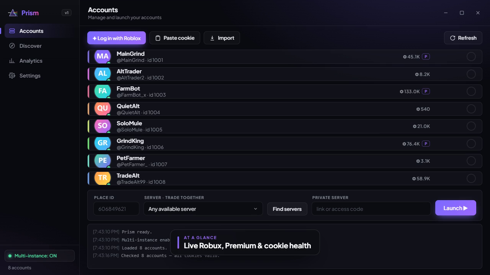
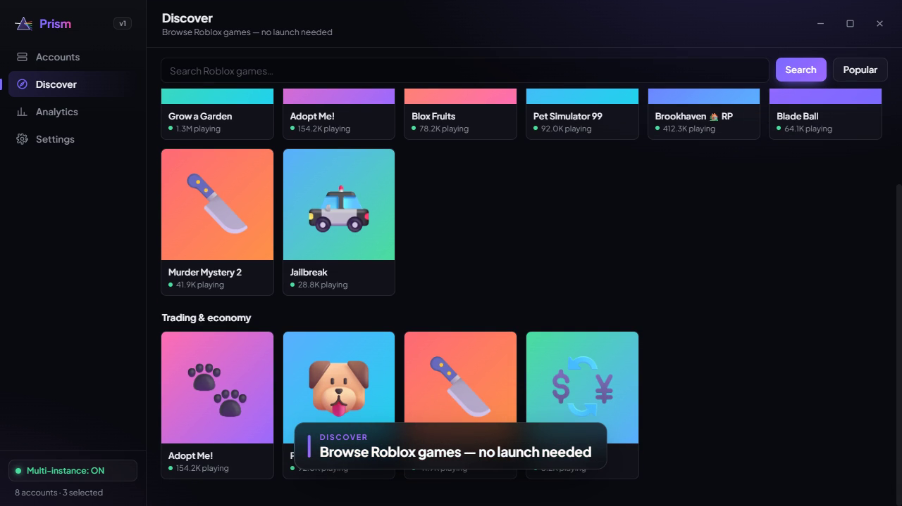
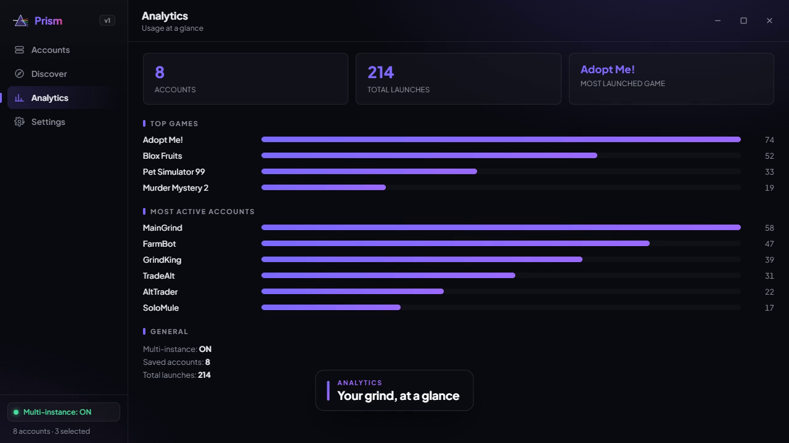
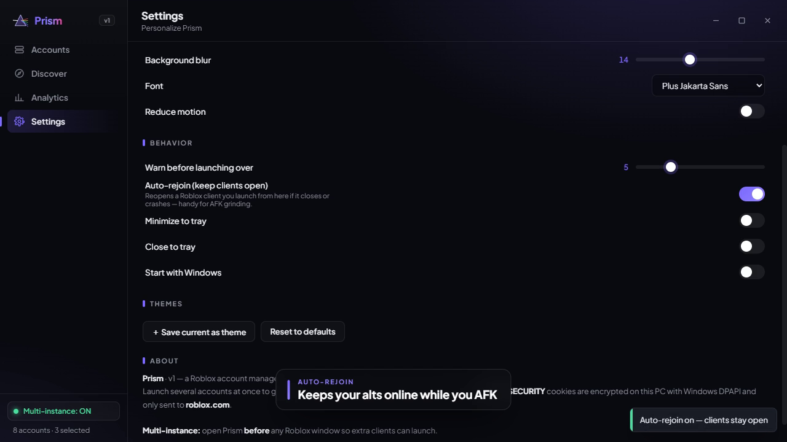

# Prism

### Launch & manage every Roblox alt — in one window.

Grind with your alts, drop them into the **same server to trade**, browse games in‑app, and theme it your way.

&nbsp;
)

---

## ✨ Demo

## 🚀 Features

- **Launch many accounts at once** — open all your alts with one click (true multi‑instance, no third‑party patches).
- **Same‑server trading** — find a server and drop several alts into it together (public or private servers).
- **In‑app game browser** — search & browse Roblox games and launch straight into them, no website needed.
- **Live account info** — Robux balance, Premium badge, and cookie health at a glance.
- **Auto‑rejoin / keep‑alive** — automatically reopens a client if it closes or crashes (great for AFK grinding).
- **Bulk import** — paste or load a file of cookies to add accounts in seconds.
- **Fully themeable** — custom accent colors, roundness, glass, blur, fonts, and saveable themes.
- **Lives in your tray** — minimize/close to tray, start with Windows.
- **Private & local** — cookies are encrypted on your PC and only ever sent to roblox.com.

## 🖼️ Screenshots

<table>
  <tr>
    <td></td>
    <td></td>
  </tr>
  <tr>
    <td></td>
    <td></td>
  </tr>
</table>

## 🧭 Getting started

1. **Open Prism _before_ any Roblox window** (so it can enable multi‑instance).
2. **Add accounts** — *Log in with Roblox* (real login in an embedded window — password/2FA/captcha all work), *Paste cookie*, or *Import* a list.
3. **Pick a Place ID** (the number in `roblox.com/games/<ID>`) or choose a game from **Discover**.
4. **Grind:** tick your alts → **Launch ▶**.
5. **Trade together:** **Find servers** and pick one (or paste a private‑server link) → tick your alts → **Launch ▶** — they all land in the same server.

## ⬇️ Download & Install

1. Grab the latest **[Prism.exe](https://github.com/Cosmic4796/Prism/releases/latest/download/Prism.exe)** from [Releases](https://github.com/Cosmic4796/Prism/releases/latest).
2. Run it — no installer, no .NET install needed (self‑contained build).

> **Heads‑up — SmartScreen:** Prism is currently **unsigned**, so Windows may show *"Windows protected your PC."* Click **More info → Run anyway**. (Some antivirus may false‑positive because the app reads cookies + launches processes — exactly what it does is described below, in the open.)

> **Requires** the free [Microsoft Edge WebView2 Runtime](https://developer.microsoft.com/microsoft-edge/webview2/) (already on most Windows 11). Prism prompts you with a link if it's missing.

## 🔒 Safety & Privacy

Prism handles Roblox cookies, so here's exactly how it treats them:

- 🔐 Your `.ROBLOSECURITY` cookies are **encrypted on your PC** with Windows **DPAPI** (bound to your Windows user — they can't be copied to another machine).
- 🌐 They are **only ever sent to roblox.com** (to validate accounts and mint launch tickets) — **never to us or any third party.**
- 📡 **No telemetry, no accounts, no servers** — Prism talks to Roblox and nothing else.
- 🙅 **Never share your cookie with anyone.** It's full access to your account, and **no one** — including "staff" — should ever ask for it.

## ⚠️ Known limitations

- Roblox doesn't *officially* support running multiple clients; the technique can be changed or blocked by a Roblox update at any time.
- A Roblox‑client regression makes in‑game **`TeleportService`** teleports work only for the most‑recently‑launched client. That's on Roblox's side.
- Roblox occasionally **rate‑limits (HTTP 429)** rapid launches; Prism staggers them and tells you if it happens.

## 💬 Support

Need help or found a bug? Join the **[Prism Support Discord](https://discord.gg/DISCORD-INVITE)** — post in `#get-help`, or check `#faq` first.

## ⚠️ Disclaimer

Prism is an independent, fan‑made tool and is **not affiliated with or endorsed by Roblox Corporation**. Running multiple accounts may violate Roblox's Terms of Service — **use at your own risk**; you are responsible for your own accounts. Provided as‑is, without warranty.

## 📄 Usage

Prism is **free to use**. Please don't repackage, rebrand, or redistribute modified builds.
